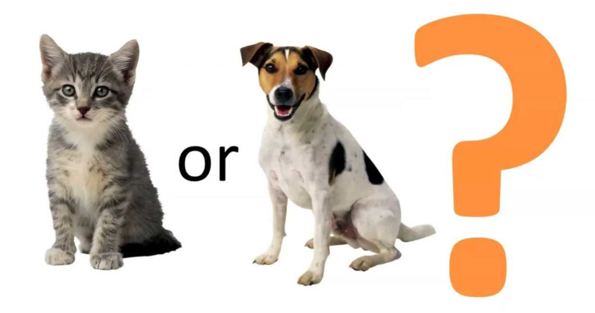

  
  
# CAT-vs-DOG-Classification
  
Le but de ce projet est de construire un algorithme de classification des images (chien/chat) capable de prédir si une image correspond à un chat ou un chien à l'aide de Tensorflow et Keras API 

On n'a pas pu importer les données sur Github vu leurs grandes tailles. Cependant vous trouverez ci-dessous un lien qui vous permettra de télécharger directement les fichiers

[https://wetransfer.com/downloads/b7134767026f86ab44d57bf800331a1d20201228135654/7287aff98e312f63911037548454f15720201228135723/a8ca01](https://wetransfer.com/downloads/b7134767026f86ab44d57bf800331a1d20201228135654/7287aff98e312f63911037548454f15720201228135723/a8ca01)

